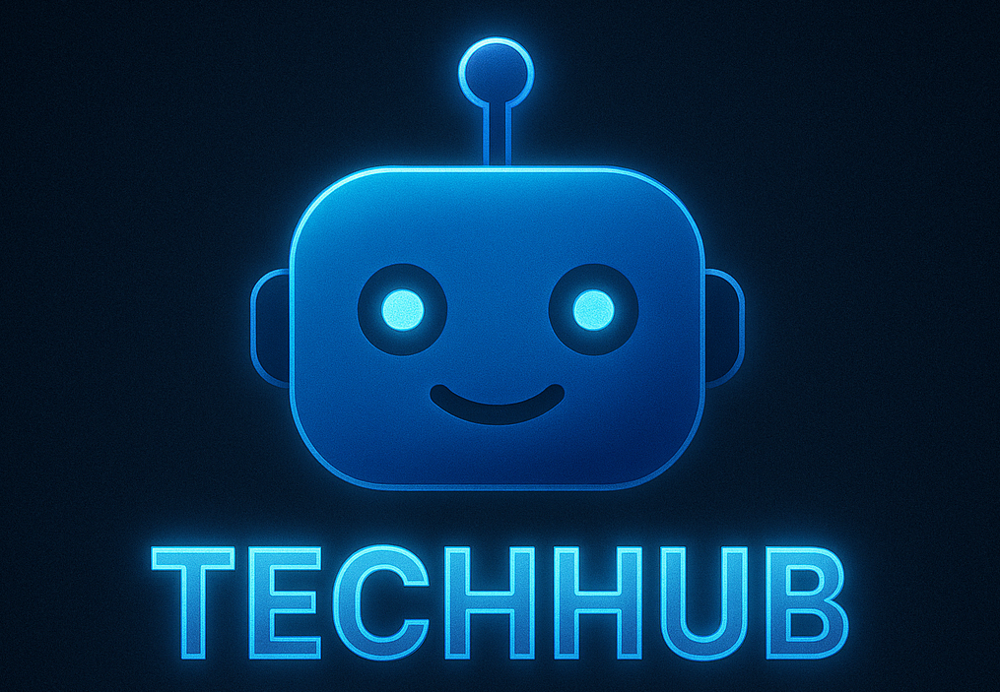

# AI Engineering Lifecycle on LangSmith Platform

<div align="center">
    
</div>

Enterprise workshop series teaching the complete AI engineering lifecycle using LangChain, LangGraph, and LangSmith—centered around building a customer support agent for a fictional online technology e-commerce store called TechHub.

## What You'll Build

A customer support agent system featuring:
- **Multi-agent architecture** with specialized Database and Documents agents coordinated by a Supervisor
- **Human-in-the-loop (HITL)** customer verification with LangGraph primitives
- **Evaluation-driven development** using offline evaluation to identify and fix bottlenecks
- **Production deployment** to LangSmith with monitoring and continuous improvement

## Quick Setup

```bash
# Clone repository
git clone https://github.com/langchain-ai/techhub-workshop.git
cd techhub-workshop

# Install dependencies

# Option 1: Using uv (recommended)
uv sync

# Option 2: Using pip with virtual environment
python -m venv .venv
source .venv/bin/activate  # On Windows: .venv\Scripts\activate
uv pip compile pyproject.toml -o requirements.txt  # Generate requirements.txt
pip install -r requirements.txt

# Configure API keys
cp .env.example .env
# Edit .env and add your API keys:
#   ANTHROPIC_API_KEY=sk-ant-...
#   LANGSMITH_API_KEY=lsv2_pt_...

# Build vectorstore (one-time setup, ~60 seconds)
python data/data_generation/build_vectorstore.py

# Launch Jupyter
jupyter lab
```
## Repo Structure

```
techhub-workshop/
├── workshop_modules/        # Interactive Jupyter notebooks
│   ├── module_1/            # Agent Development (4 sections)
│   ├── module_2/            # Evaluation & Improvement (2 sections)
│   └── module_3/            # Deployment & Monitoring (coming soon)
│
├── agents/                  # Reusable agent factory functions
│   ├── db_agent.py          # Database queries (rigid tools)
│   ├── sql_agent.py         # Flexible SQL generation (improved)
│   ├── docs_agent.py        # RAG for product docs & policies
│   ├── supervisor_agent.py  # Multi-agent coordinator
│   └── supervisor_hitl_agent.py  # Full verification + routing system
│
├── tools/                   # Database & document search tools
│   ├── database.py          # 6 DB tools (orders, products, SQL)
│   └── documents.py         # 2 RAG tools (products, policies)
│
├── evaluators/              # Evaluation metrics
│   └── evaluators.py        # Correctness & tool call counters
│
├── deployments/             # Production-ready graph configurations
│   ├── db_agent_graph.py                   # Baseline database agent
│   ├── docs_agent_graph.py                 # RAG documents agent
│   ├── sql_agent_graph.py                  # Improved SQL agent
│   ├── supervisor_agent_graph.py           # Basic supervisor
│   ├── supervisor_hitl_agent_graph.py      # Supervisor with verification
│   └── supervisor_hitl_sql_agent_graph.py  # Complete system (best)
│
├── data/                    # Complete dataset & generation scripts
│   ├── structured/          # SQLite DB + JSON files
│   ├── documents/           # Markdown docs for RAG
│   ├── vector_stores/       # Pre-built vectorstore
│   └── data_generation/     # Scripts to regenerate data
│
├── config.py                # Workshop-wide configuration
├── langgraph.json           # LangGraph deployment config
└── pyproject.toml           # Dependencies
```

## Workshop Structure

### Module 1: Agent Development

Build from manual tool calling to production-ready multi-agent systems.

**Section 1: Foundation** (`workshop_modules/module_1/section_1_foundation.ipynb`)
- Manual tool calling loop with database tools
- Understanding how agents work under the hood

**Section 2: Create Agent** (`section_2_create_agent.ipynb`)
- Using `create_agent()` abstraction
- Memory with checkpointers and thread separation
- Streaming for better UX

**Section 3: Multi-Agent** (`section_3_multi_agent.ipynb`)
- Database Agent (order status, product info, pricing)
- Documents Agent (product specs, policies via RAG)
- Supervisor Agent coordinating parallel and sequential tasks

**Section 4: LangGraph HITL** (`section_4_langgraph_hitl.ipynb`)
- Customer verification with `interrupt()` for HITL
- Query classification and conditional routing
- Dynamic prompts injecting state (customer_id)
- Full integration of verification + supervisor + sub-agents

### Module 2: Evaluation & Improvement

Learn evaluation-driven development to systematically improve agents.

**Section 1: Baseline Evaluation** (`workshop_modules/module_2/section_1_baseline_evaluation.ipynb`)
- Curated dataset with ground truth examples
- LLM-as-judge correctness evaluator
- Trace-based tool call counter
- Running experiments in LangSmith

**Section 2: Eval-Driven Development** (`section_2_eval_driven_development.ipynb`)
- Identified problem: Rigid DB tools → excessive tool calls
- Solution: SQL Agent with flexible query generation
- Re-evaluation showing quantitative improvement
- Composing improved agent with existing system

### Module 3: Deployment & Monitoring (Coming Soon 🚧)

Deploy to production with LangSmith and implement monitoring.

**Planned Sections:**
- LangGraph Studio for local testing
- Deployment to LangSmith
- Production monitoring and dashboards
- Online evaluation and data flywheels

## Getting Started

1. **Start here:** Open `workshop_modules/module_1/section_1_foundation.ipynb`
2. **Work sequentially** through sections - each builds on the previous
3. **Run all cells** - notebooks are self-contained with explanations and examples
4. **Check LangSmith traces** - links provided throughout notebooks

Each notebook includes:
- 📖 Clear explanations of concepts
- 💻 Working code examples
- 🎯 Hands-on exercises
- 🔗 Links to LangSmith traces for observability

## Key Concepts Covered

### Agent Development
- Tool calling and agent loops
- Multi-agent systems with supervisor pattern
- Sub-agent coordination (parallel & sequential)
- State management and memory
- Human-in-the-loop with interrupts

### Evaluation & Testing
- Offline evaluation with LangSmith
- LLM-as-judge evaluators
- Trace-based metrics
- Experiment comparison
- Evaluation-driven development workflow

### Production Best Practices
- Factory functions for agent reusability
- Separation of dev (checkpointer) vs. deploy (platform-managed)
- Dynamic prompts with state injection
- Structured outputs with Pydantic
- Streaming for better UX

## Dataset Overview

The **TechHub dataset** is a high-quality synthetic e-commerce dataset:
- **50 customers** across consumer, corporate, and home office segments
- **25 products** (laptops, monitors, keyboards, audio, accessories)
- **250 orders** spanning 2 years with realistic patterns
- **439 order items** with product affinity patterns
- **SQLite database** (156 KB) with full schema and indexes
- **30 documents** (25 product specs + 5 policies) for RAG

All data is ready to use! See `data/data_generation/README.md` for details.

## Additional Resources

### Documentation
- **Data Generation Guide:** `data/data_generation/README.md` - Complete dataset documentation
- **Database Schema:** `data/structured/SCHEMA.md` - Full schema reference
- **RAG Documents:** `data/documents/DOCUMENTS_OVERVIEW.md` - Document corpus guide
- **Agent Architecture:** `agents/README.md` - Agent factory patterns

### External Links
- [LangChain Python Docs](https://python.langchain.com)
- [LangGraph Python Docs](https://langchain-ai.github.io/langgraph)
- [LangSmith Platform](https://smith.langchain.com)
- [LangChain Academy](https://academy.langchain.com)

## Prerequisites

### Required (Complete Before Workshop)

Free courses from [LangChain Academy](https://academy.langchain.com):
- [LangChain Essentials - Python](https://academy.langchain.com/courses/langchain-essentials-python) (30 min)
- [LangGraph Essentials - Python](https://academy.langchain.com/courses/langgraph-essentials-python) (1 hour)
- [LangSmith Essentials](https://academy.langchain.com/courses/quickstart-langsmith-essentials) (30 min)

### Recommended (For Deeper Understanding)

- [Foundation: Introduction to LangGraph](https://academy.langchain.com/courses/intro-to-langgraph) (6 hours)
- [Foundation: Introduction to Agent Observability & Evaluations](https://academy.langchain.com/courses/intro-to-langsmith) (3.5 hours)

### Technical Requirements

- **Python 3.10+**
- **API Keys:**
  - LangSmith (free tier: [smith.langchain.com](https://smith.langchain.com))
  - Anthropic or OpenAI (workshop uses Claude Haiku 4.5 by default)
- **Tools:** Git, Jupyter, uv (or pip)

## License

This project is licensed under the Apache License 2.0 - see the [LICENSE](LICENSE) file for details.

Educational workshop materials. Synthetic dataset free to use and distribute.

---

**Ready to begin?** Open `workshop_modules/module_1/section_1_foundation.ipynb` and start building! 🚀
